<h1 align="center">Informe Técnico</h1>

<div align="center">
    <p>
    <p><strong>Autores:</strong> Gabriela Aldana, Santiago Jorigua, Juan Reina
    </p>
</div>

## 1. Descripción del dataset y del problema

En la página web `[Datos abierto](https://datosabiertos-transmilenio.hub.arcgis.com/)`  encontramos los Datos Abiertos de TRANSMILENIO S. A. . En este portal de acceso podemos encontrar distintos datos sobre el sistema masivo de transporte de la ciudad, desde sus servicios troncales (BRT "Transmilenio") y  zonales (comúnmente llamado buses SITP). En este proyecto queremos predecir las **validaciones** (entradas) al sistema  Transmilenio para tres troncales:
- Troncal B Norte
- Troncal K Calle 26
- Troncal G NQS Sur
*Estas troncales fueron elegidas de manera arbitraria.*

La fuente de Datos Abiertos TRANSMILENIO S.A. nos provee de las validaciones mensuales para el año 2026 de todo el sistema troncal. Para efectos de este ejercicio solo usaremos los datos para el mes de agosto del año mencionado. En el archivo encontramos el DataSet para el respectivo mes con las siguientes variables:

| Variable | Descripción | Tipo|
| --- | --- | --- |
|Fase | Fase a la que pertenece el servicio. (Antigüedad de la troncal) | Categórica|
|Línea | Troncal a la que pertenece la estación. | Texto |
| Estación |  Código y Nombre de la estación | Texto |
| Acceso de Estación |Acceso o talanqueras por la que se contaron las validaciones de la estación. | Numérica Discreta |
|Intervalo  | Intervalo de 15 minutos en los que se cuentan las cantidades de validaciones realizadas por cada acceso. |  Numérica Discreta |
| Fechas | Las últimas 31 columnas representan cada uno de los días del mes. El valor que alojan en esta variable son las cantidades de validaciones que se realizaron en el día respectivo. | Numérica Discreta |

<div align="center">
    <p>Datos en bruto</p>
    
</div>

## 2. Exploración y decisiones de limpieza

### 2.1 Carga y Limpieza de datos
En primera instancia, para simplificar el problema no tendremos en cuenta a los servicios de Fase Dual, estas estaciones contienen servicios de rutas que no solo paran en estaciones del servicio troncal sino también del zonal.

Como se puede apreciar en la sección anterior, los datos están en una matriz a lo ancho, donde las últimas columnas corresponden a los distintos días del mes de agosto. En este formato, cada fila representa una combinación de línea, estación e intervalo de tiempo, mientras que cada columna adicional contiene el número de validaciones registradas para un día específico.

Este formato resulta poco conveniente para realizar análisis estadísticos y construir modelos, ya que la fecha se encuentra representada como una variable implícita en el nombre de las columnas. Por esta razón, se realiza una transformación de los datos de formato ancho (wide) a formato largo (long) mediante la función melt() de pandas.

Después de realizar esta transformación, la columna Fecha se convierte al tipo datetime, lo que permite trabajar correctamente con las fechas y facilita posteriormente la extracción de información como el día, mes o día de la semana.
<div align="center">
    
</div>

Finalmente, se agrupan los registros por Línea, Estación, Intervalo y Fecha, sumando las validaciones. Esta agregación es importante porque puede existir más de un registro para una misma combinación de estas variables, por ejemplo, cuando una estación cuenta con diferentes accesos o registros que deben representar conjuntamente el total de validaciones de la estación en un intervalo determinado.

El resultado es un conjunto de datos en formato largo en el que cada fila representa una observación correspondiente a una estación, un intervalo de tiempo y una fecha específica. Esta estructura facilita tanto la exploración de los datos como la posterior construcción de modelos estadísticos.

**Decisiones de limpieza**

| Decisión | Justificación |
|---|---|
| Se excluyen las filas con Fase "Dual" | Quedan 123 estaciones. Deja por fuera estaciones como Alcalá y los portales; es una limitación del alcance |
| Se suman los accesos de una misma estación | La unidad de análisis es la estación, no la puerta |
| Los festivos entre semana (7 y 17 de agosto) se agrupan con los domingos | Su demanda se parece más a la de un domingo que a la de un día hábil |
| No se eliminan ceros ni estaciones con pocos registros | Son observaciones reales |
| La fecha no entra como variable | Con un solo mes no hay tendencia que aprender; su información útil está en `tipo_dia` |

### 2.2 Exploración y Análisis Descriptivo
#### Calidad de los datos
Antes de utilizar los datos para la construcción de los modelos, se realizó una revisión de su calidad con el objetivo de identificar valores faltantes, registros duplicados, inconsistencias y posibles anomalías que pudieran afectar el análisis.

```text
Registros: 294,004
Estaciones: 123
Troncales: 14
Días: 31 (del 2026-08-01 al 2026-08-31)
Validaciones en total: 31,016,651

Nulos por columna: {'linea': 0, 'estación': 0, 'intervalo': 0, 'fecha': 0,
    'validaciones': 0, 'tipo_dia': 0, 'hora': 0, 'dia_semana': 0}

Registros repetidos (misma estación, fecha y franja): 0
Validaciones negativas: 0

Franjas por estación y día: mínimo 1, mediana 79, máximo 87
Registros por estación: mínimo 31, máximo 2,697
Estaciones que aparecen en más de una troncal: 0

Registros con validaciones en cero: 7.8% del total | entre 5:00 y 21:00: 2.3%
```
La siguiente tabla presenta los principales estadísticos descriptivos de la variable validaciones. Se cuenta con 294.004 observaciones, cuyo promedio es de 105,5 validaciones por registro y cuya desviación estándar es de 217,1.
| Variable       | Count    | Mean  | Std   | Min | 25%  | 50% | 75%  | 90%  | 99%   | Max  |
|----------------|---------:|------:|------:|----:|-----:|----:|-----:|-----:|------:|-----:|
| Validaciones   | 294,004  | 105.5 | 217.1 | 0.0 | 14.0 | 46.0 | 108.0 | 240.0 | 1,022.0 | 4,687.0 |

La diferencia considerable entre la media y la desviación estándar evidencia una alta dispersión en el número de validaciones. Esto se puede observar también al comparar los percentiles: el 50 % de las observaciones presenta 46 validaciones o menos, mientras que el 75 % presenta como máximo 108 validaciones. En contraste, el 10 % superior de las observaciones supera aproximadamente las 240 validaciones.

---
Para el efecto práctico de nuestro modelo, deseamos que no todos los registros de validaciones sean nulos (franjas de tiempo donde ninguna persona entra al sistema de transporte). La siguiente gráfica muestra el porcentaje de registros nulos dada una hora del día.
<div align="center">
    
</div>
Para cada franja horaria vemos que durante el horario de operación casi ningún registro es nulo.

#### Distribución de la variable objetivo
<div align="center">
    
</div>
Nuestra variable objetivo se distribuye con una gran asimetría. Al usar una escala logarítmica podemos ver cómo se distribuyen de una manera más balanceada en la cantidad de registros.

#### Demanda día a día
<div align="center">
    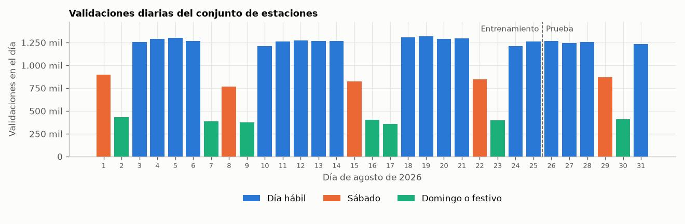
</div>
Podemos ver cómo para cada tipo de día durante el més la cantidad de validaciones al sistema cambia. Los días hábiles, como es de esperar, tienen la mayor cantidad de entradas al sistema.

#### Perfil a lo largo del día

<div align="center">
    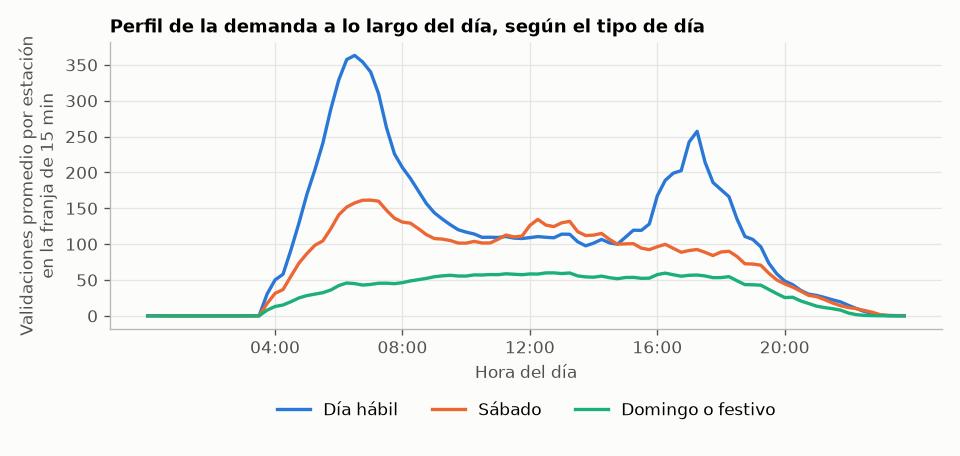
</div>
En los días hábiles se notan claramente a lo largo del sistema dos picos de tráfico durante el día. En días de menos tránsito como fines de semana y festivo se ve una cantidad casi constante de validaciones.

#### Las tres estaciones de estudio

<div align="center">
    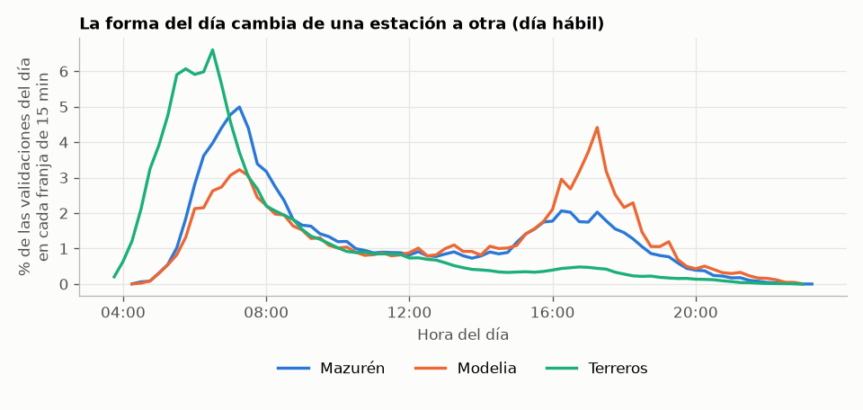
</div>
Para este estudio nos enfocaremos en tres estaciones de las tres troncales que queremos predecir. Podemos ver cómo las validaciones cambian para cada una de las estaciones. Terreros solo tiene un gran pico por la mañana, Mazurén tiene dos picos pero el primero es mayor. Mientras que Modelia presenta el efecto contrario de Mazurén al tener un pico mayor por la tarde.

#### Correlaciones entre variables
<div align="center">
    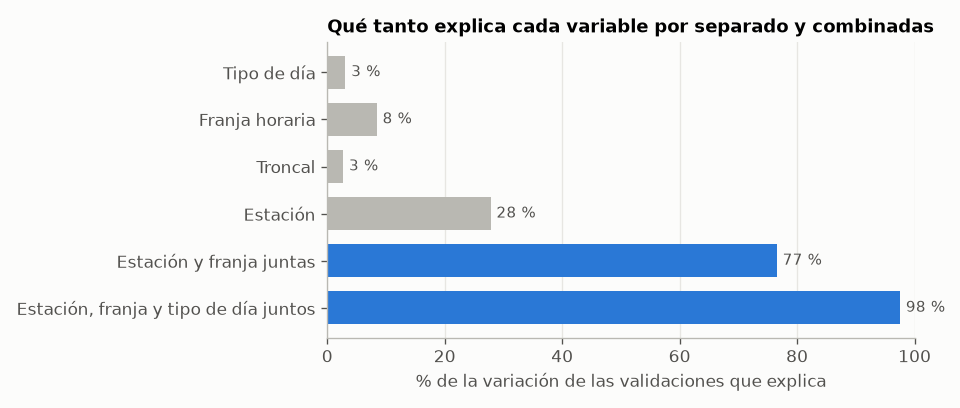
</div>
Para este estudio vamos a agregar las variables de estación, franja y tipo de día (si es hábil o día de descanso) entre ellas. Podemos ver cómo la suma de estas explican en su mayoría el movimiento de la variable objetivo.

<div align="center">
    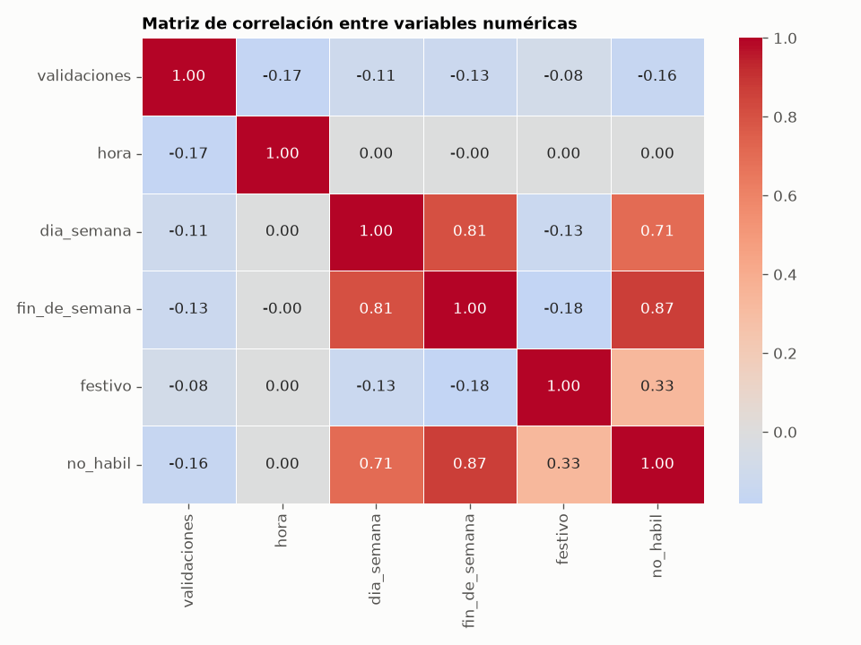
</div>
Las variables que claramente más se relaciones son la tipología del día con si es entre o fin de semana.

#### Valores Atípicos

<div align="center">
    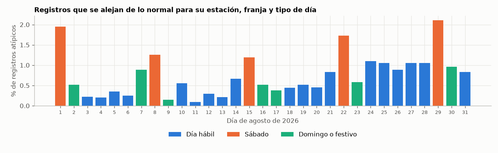
</div>
Aunque el porcentaje no es muy grande, podemos ver cómo los días que más datos atípicos tiene son los sábados. Posiblemente explicado por actividades que la gente tiene durante esos días.

### 2.3 Separación Entrenamiento/Prueba
Para evaluar el desempeño de los modelos, los datos se dividen temporalmente en dos conjuntos. En lugar de realizar una división aleatoria, se utiliza la fecha como criterio de separación. Los registros correspondientes a los días 1 al 25 de agosto se utilizan como conjunto de entrenamiento, mientras que los registros de los días 26 al 31 de agosto se reservan para el conjunto de prueba.
<div align="center">
    
</div>
Esta estrategia permite simular una situación más cercana a la aplicación real del modelo: se entrena utilizando información disponible hasta una determinada fecha y posteriormente se evalúa su capacidad para predecir observaciones de días posteriores. De esta manera, se evita utilizar información del futuro durante el entrenamiento, lo que podría producir una estimación demasiado optimista del desempeño del modelo.

## 3. Métodos aplicados: planteamiento, hiperparámetros (rango probado, valor elegido, por qué) y evaluación
### 3.1 Preparación de variables
- **Variable a predecir:** validaciones en la franja de 15 minutos.
- **Categóricas** (`linea`, `estación`, `tipo_dia`): codificación one-hot.
- **Cruces** (`est_franja`, `dia_franja`, `est_dia`): permiten que cada estación tenga su propia curva
  por hora y que esa curva cambie según el tipo de día (hallazgo de la sección 2.6).
- **Hora:** el intervalo como número (05:15 → 5,25), estandarizado. Las columnas one-hot ya están
  todas en la misma escala (0 o 1), así que no se reescalan.
- **Fecha:** no entra directamente.

La preparación va dentro de un *pipeline*: en cada pliegue se ajusta solo con los datos de
entrenamiento de ese pliegue, sin fuga de información. La validación cruzada es de 5 pliegues.

### 3.2 Entrenamiento sin cruces vs variable con cruces
Al hacer el entrenamiento sin las variables de Cruces anteriormente mencionada, obtenemos los siguientes resultados:
| Modelo                | RMSE    | R²    |
|-----------------------|--------:|------:|
| OLS sin cruces        | 176.360 | 0.335 |
| Splines sin cruces    | 169.001 | 0.389 |
| OLS con cruces        |  86.867 | 0.839 |
| Splines con cruces    |  86.867 | 0.839 |

Los modelos pifian las predicciones por un margen extremo al no usar las variables cruzadas. Los modelos asumen que las mismas variables como $Hora_{Modelia} = Hora_{Mazurén}$ son iguales. Pero para cada estación las mismas variables no son iguales, al hacer las variables dummmy de todas las combinaciones posibles el modelo genera una curva para cada una de ellas.
<div align="center">
    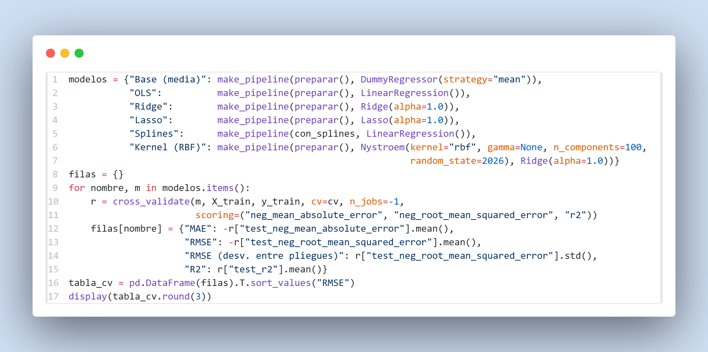
</div>

De esta forma aplicamos la preparación adecuada de combinaciones entre variables junto con optimización de hiperparámetros mediante búsqueda en grilla. A partir del anterior bloque obtenemos el siguiente resultado: 

| Modelo        | MAE     | RMSE    | RMSE (desv. entre pliegues) | R²     |
|---------------|--------:|--------:|----------------------------:|-------:|
| Ridge         | 41.806  | 86.853  | 1.029                       | 0.839  |
| OLS           | 41.331  | 86.867  | 1.096                       | 0.839  |
| Splines       | 41.331  | 86.867  | 1.096                       | 0.839  |
| Lasso         | 85.101  | 181.106 | 2.393                       | 0.298  |
| Kernel (RBF)  | 94.517  | 200.972 | 3.142                       | 0.136  |
| Base (media)  | 104.648 | 216.219 | 2.379                       | -0.000 |

## 4. Matriz de aplicabilidad
| Método | ¿Aporta? | RMSE en CV | Justificación |
|---|---|---|---|
| Base (media) | Referencia | 216,2 ± 2,4 | Piso de comparación |
| OLS | Sí | 86,87 ± 1,10 | Modelo de referencia. Con los cruces de estación, franja y tipo de día baja el error un 60 % frente a la base (R² 0,84) |
| Ridge | Sí, por estabilidad | 86,84 ± 1,03 (alpha = 0,1) | En error empata con OLS (0,03 de diferencia frente a 1,0 de variación entre pliegues). Aporta porque las columnas son redundantes (la troncal la determina la estación y los cruces contienen a los efectos sueltos): OLS no tiene solución única y Ridge sí |
| Lasso | No | 181,1 ± 2,4 (alpha = 1) | Lasso sirve para descartar variables irrelevantes, y aquí no las hay: cada cruce estación-franja lleva información. Al penalizar, apaga esos cruces y vuelve al modelo sin interacciones |
| Splines | No | 86,87 ± 1,10 | Da exactamente lo mismo que OLS con cualquier número de nudos (de 5 a 80). Con un coeficiente por estación y franja, la curva horaria ya está descrita por completo. Sin los cruces sí aportaba (celda 3.3b) |
| Kernel (RBF) | No | 201,0 ± 3,1 | El kernel exacto no cabe en memoria (237.100 × 237.100). La aproximación de Nyström resume los datos con unos cientos de puntos de referencia y no alcanza a cubrir las cerca de 9.500 combinaciones de estación y franja |


## 5. Comparación de los finalistas
### 5.1 Métricas base
Para esta parte, utilizamos por primera vez el conjunto de datos de prueba.
<div align="center">
    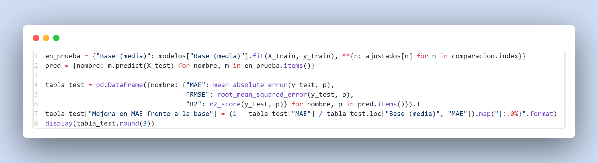
</div>
De este bloque obtenemos los siguientes resultados:

| Modelo        | MAE test   | RMSE test   | R² test    | Mejora en MAE frente a la base |
|---------------|--------:|--------:|-------:|--------------------------------:|
| Base (media)  | 105.140 | 220.670 | -0.001 | 0%                              |
| Ridge         |  38.801 |  80.397 |  0.867 | 63%                             |
| OLS           |  38.729 |  80.347 |  0.867 | 63%                             |
| Splines       |  38.729 |  80.347 |  0.867 | 63%                             | 

Los finalistas tienen un performance casi perfectamente igual. Indicando que la estructura natural de los datos cruzados conservan la curvatura intrínseca de ellos. Por eso todos tienden a predecir la misma curva con los mismos errores.

### 5.2 Comparación con Bootstrap

Se remuestrean 1.000 veces los días de los datos de prueba (días completos, porque las franjas de un mismo día se parecen entre sí) y se recalcula el error de cada modelo. Si el intervalo del 95 % de la diferencia frente al mejor no incluye el 0, la ventaja es real.
<div align="center">
    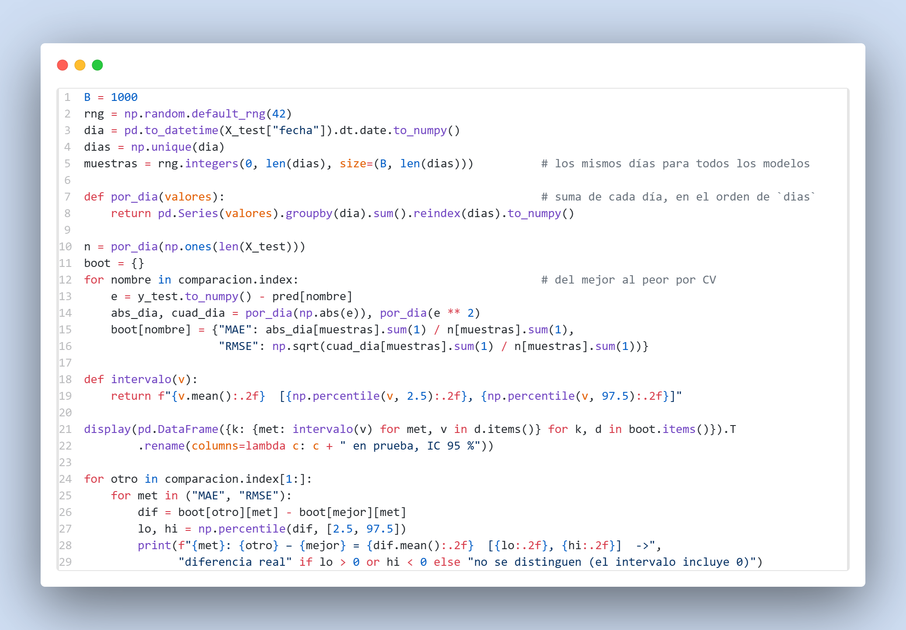
</div>

| Modelo  | MAE en prueba, IC 95 % | RMSE en prueba, IC 95 % |
|---------|------------------------:|-------------------------:|
| Ridge   | 38.75 [34.23, 46.81]   | 79.80 [67.06, 98.26]    |
| OLS     | 38.67 [34.12, 46.83]   | 79.74 [67.03, 98.43]    |
| Splines | 38.67 [34.12, 46.83]   | 79.74 [67.03, 98.43]    |

Para todos nuestros finalistas, los intervalos de confianza se ven bastante similares, reforzando la explicación de que todos tienden a la misma curva y no tener una ventaja real entre modelos. Aunque Ridge sea bastante similar a los otros dos modelos, será elegido como mejor modelo porque minimiza marginalmente el error.

### 5.3 Comportamiento en estaciones seleccionadas

El mejor modelo frente a los datos reales en dos lunes hábiles: arriba uno de entrenamiento (24 de agosto) y abajo el de prueba (31 de agosto), que el modelo nunca vio. Los puntos son los datos reales y la línea es la predicción. La tabla compara el error de cada estación en entrenamiento y en prueba. La celda siguiente repite el ejercicio con dos sábados (22 y 29 de agosto).

<div align="center">
    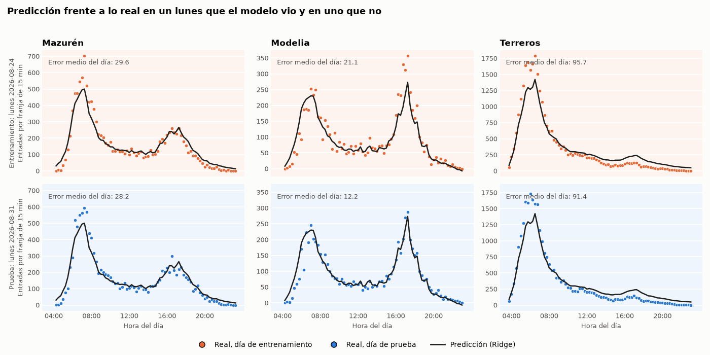
</div>

Podemos ver cómo el modelo "ignora" la fecha en la que ocurren estas validaciones, pero mantiene la estructura entre los días de la semana. En este caso que son un lunes de entrenamiento y el otro de test las curvas son particularmente similares y logra interpretar de manera exitosa los puntos de test.

Pero este resultado puede ser una particularidad de elegir un día entre semana, a continuación se hace el mismo test pero para un día sábado en test y en train.

<div align="center">
    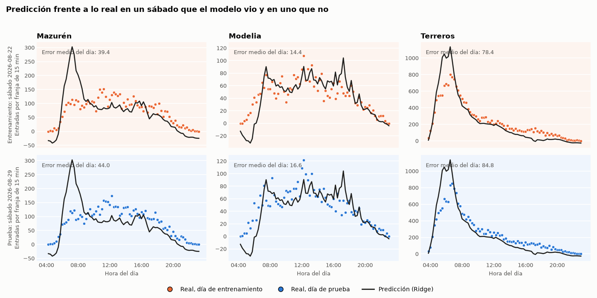
</div>

Podemos ver cómo no para todas las estaciones seleccionadas la curva se comporta de buena manera, podemos ver en cómo existe un sesgo en el modelo de intentar replicar los comportamientos de días entre semana al ser mayoría en el conjunto de entrenamiento.

## 6. Decisión final

- **Modelo escogido:** Ridge con alpha = 0,1, sobre las variables estación, troncal, tipo de día y sus cruces con la franja horaria.
- **Error en prueba:** MAE de 38,8 validaciones por franja de 15 minutos (IC 95 %: 34,2 a 46,8), RMSE de 80,4 y R² de 0,87. Es un 63 % menos que la línea base (MAE 105,1).
- **Frente a los otros finalistas:** empate. La diferencia de MAE con OLS es de −0,08 [−0,22; 0,11] y con Splines la misma, porque Splines y OLS dan predicciones idénticas. Los intervalos incluyen el cero.
- **Por qué Ridge y no OLS:** como el error es el mismo, se decide por contexto. Las columnas son redundantes, así que OLS no tiene coeficientes únicos; Ridge sí, con el mismo costo de cómputo y un solo hiperparámetro que no quedó en el borde.
- **Por estación (MAE en prueba):** Mazurén 31,2 (25 % de su demanda promedio), Modelia 16,9 (24 %) y Terreros 106,8 (36 %). Donde más falla es en Terreros, la más grande y la más concentrada en la mañana.
- **No hay sobreajuste:** el error en prueba (RMSE 80,4) no supera al de validación cruzada (86,8), y por estación el error en entrenamiento y en prueba es casi igual (Mazurén 31,4 y 31,2).
- **Qué es el modelo en la práctica:** el perfil promedio de cada estación en cada franja, corregido por el tipo de día. Sirve para planear un día normal, no para anticipar un día atípico.

## 7. Limitaciones y posibles mejoras

- Un solo mes de datos y solo seis días de prueba (un sábado y un domingo): los intervalos son anchos.
- Los dos festivos entre semana están en entrenamiento; el modelo no se probó en un festivo.
- No usa la oferta de buses ni eventos (marchas, cierres, lluvia).
- Se excluyeron las filas con Fase "Dual", así que no cubre estaciones como Alcalá ni los portales.
- El error absoluto crece con el tamaño de la estación; modelar el logaritmo de las validaciones es una mejora posible.