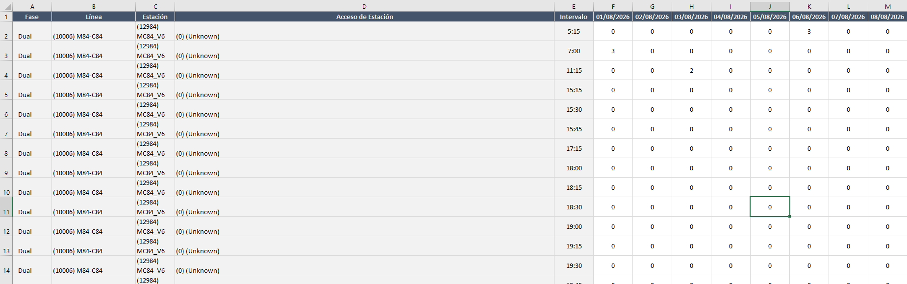
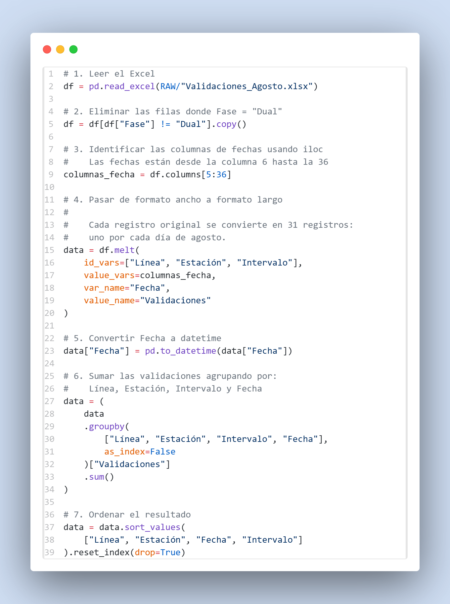
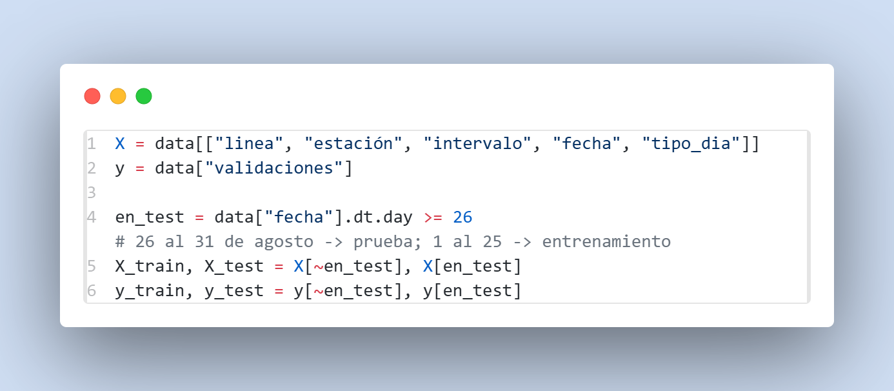

<h1 align="center">Informe Técnico</h1>

<div align="center">
    <p>
    <p><strong>Autores:</strong> Gabriela Aldana, Santiago Jorigua, Juan Reina
    </p>
</div>

## 1. Descripción del dataset y del problema

En la página web `[Datos abierto](https://datosabiertos-transmilenio.hub.arcgis.com/)`  encontramos los Datos Abiertos de TRANSMILENIO S. A. . En este portal de acceso podemos encontrar distintos datos sobre el sistema masivo de transporte de la ciudad, desde sus servicios troncales (BRT "Transmilenio") y  zonales (comúnmente llamado buses SITP). En este proyecto queremos predecir las **validaciones** (entradas) al sistema  Transmilenio para tres troncales:
- Troncal B Norte
- Troncal K Calle 26
- Troncal G NQS Sur
*Estas troncales fueron elegidas de manera arbitraria.*

La fuente de Datos Abiertos TRANSMILENIO S.A. nos provee de las validaciones mensuales para el año 2026 de todo el sistema troncal. Para efectos de este ejercicio solo usaremos los datos para el mes de agosto del año mencionado. En el archivo encontramos el DataSet para el respectivo mes con las siguientes variables:

| Variable | Descripción | Tipo|
| --- | --- | --- |
|Fase | Fase a la que pertenece el servicio. (Antigüedad de la troncal) | Categórica|
|Línea | Troncal a la que pertenece la estación. | Texto |
| Estación |  Código y Nombre de la estación | Texto |
| Acceso de Estación |Acceso o talanqueras por la que se contaron las validaciones de la estación. | Numérica Discreta |
|Intervalo  | Intervalo de 15 minutos en los que se cuentan las cantidades de validaciones realizadas por cada acceso. |  Numérica Discreta |
| Fechas | Las últimas 31 columnas representan cada uno de los días del mes. El valor que alojan en esta variable son las cantidades de validaciones que se realizaron en el día respectivo. | Numérica Discreta |

<div align="center">
    <p>Datos en bruto</p>
    
</div>

## 2. Exploración y decisiones de limpieza

### 2.1 Carga y Limpieza de datos
En primera instancia, para simplificar el problema no tendremos en cuenta a los servicios de Fase Dual, estas estaciones contienen servicios de rutas que no solo paran en estaciones del servicio troncal sino también del zonal.

Como se puede apreciar en la sección anterior, los datos están en una matriz a lo ancho, donde las últimas columnas corresponden a los distintos días del mes de agosto. En este formato, cada fila representa una combinación de línea, estación e intervalo de tiempo, mientras que cada columna adicional contiene el número de validaciones registradas para un día específico.

Este formato resulta poco conveniente para realizar análisis estadísticos y construir modelos, ya que la fecha se encuentra representada como una variable implícita en el nombre de las columnas. Por esta razón, se realiza una transformación de los datos de formato ancho (wide) a formato largo (long) mediante la función melt() de pandas.

Después de realizar esta transformación, la columna Fecha se convierte al tipo datetime, lo que permite trabajar correctamente con las fechas y facilita posteriormente la extracción de información como el día, mes o día de la semana.
<div align="center">
    
</div>

Finalmente, se agrupan los registros por Línea, Estación, Intervalo y Fecha, sumando las validaciones. Esta agregación es importante porque puede existir más de un registro para una misma combinación de estas variables, por ejemplo, cuando una estación cuenta con diferentes accesos o registros que deben representar conjuntamente el total de validaciones de la estación en un intervalo determinado.

El resultado es un conjunto de datos en formato largo en el que cada fila representa una observación correspondiente a una estación, un intervalo de tiempo y una fecha específica. Esta estructura facilita tanto la exploración de los datos como la posterior construcción de modelos estadísticos.
### 2.2 Exploración y Análisis Descriptivo
#### Calidad de los datos
Antes de utilizar los datos para la construcción de los modelos, se realizó una revisión de su calidad con el objetivo de identificar valores faltantes, registros duplicados, inconsistencias y posibles anomalías que pudieran afectar el análisis.

```text
Registros: 294,004
Estaciones: 123
Troncales: 14
Días: 31 (del 2026-08-01 al 2026-08-31)
Validaciones en total: 31,016,651

Nulos por columna: {'linea': 0, 'estación': 0, 'intervalo': 0, 'fecha': 0,
    'validaciones': 0, 'tipo_dia': 0, 'hora': 0, 'dia_semana': 0}

Registros repetidos (misma estación, fecha y franja): 0
Validaciones negativas: 0

Franjas por estación y día: mínimo 1, mediana 79, máximo 87
Registros por estación: mínimo 31, máximo 2,697
Estaciones que aparecen en más de una troncal: 0

Registros con validaciones en cero: 7.8% del total | entre 5:00 y 21:00: 2.3%
```
La siguiente tabla presenta los principales estadísticos descriptivos de la variable validaciones. Se cuenta con 294.004 observaciones, cuyo promedio es de 105,5 validaciones por registro y cuya desviación estándar es de 217,1.
| Variable       | Count    | Mean  | Std   | Min | 25%  | 50% | 75%  | 90%  | 99%   | Max  |
|----------------|---------:|------:|------:|----:|-----:|----:|-----:|-----:|------:|-----:|
| Validaciones   | 294,004  | 105.5 | 217.1 | 0.0 | 14.0 | 46.0 | 108.0 | 240.0 | 1,022.0 | 4,687.0 |

La diferencia considerable entre la media y la desviación estándar evidencia una alta dispersión en el número de validaciones. Esto se puede observar también al comparar los percentiles: el 50 % de las observaciones presenta 46 validaciones o menos, mientras que el 75 % presenta como máximo 108 validaciones. En contraste, el 10 % superior de las observaciones supera aproximadamente las 240 validaciones.


### 2.3 Separación Entrenamiento/Prueba
Para evaluar el desempeño de los modelos, los datos se dividen temporalmente en dos conjuntos. En lugar de realizar una división aleatoria, se utiliza la fecha como criterio de separación. Los registros correspondientes a los días 1 al 25 de agosto se utilizan como conjunto de entrenamiento, mientras que los registros de los días 26 al 31 de agosto se reservan para el conjunto de prueba.
<div align="center">
    
</div>
Esta estrategia permite simular una situación más cercana a la aplicación real del modelo: se entrena utilizando información disponible hasta una determinada fecha y posteriormente se evalúa su capacidad para predecir observaciones de días posteriores. De esta manera, se evita utilizar información del futuro durante el entrenamiento, lo que podría producir una estimación demasiado optimista del desempeño del modelo.

## 3. Matriz de aplicabilidad

## 4. Métodos aplicados: planteamiento, hiperparámetros (rango probado, valor elegido, por qué) y evaluación


## 5. Comparación de los finalistas
## 6. Decisión final
## 7. Limitaciones y posibles mejoras
